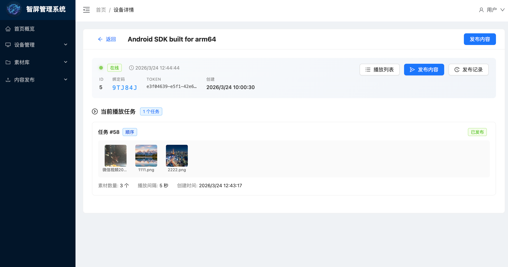
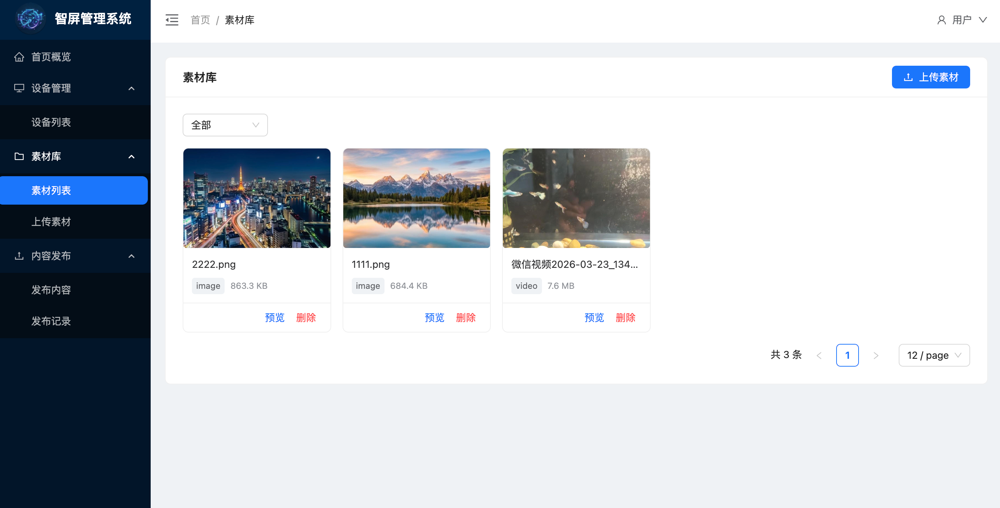
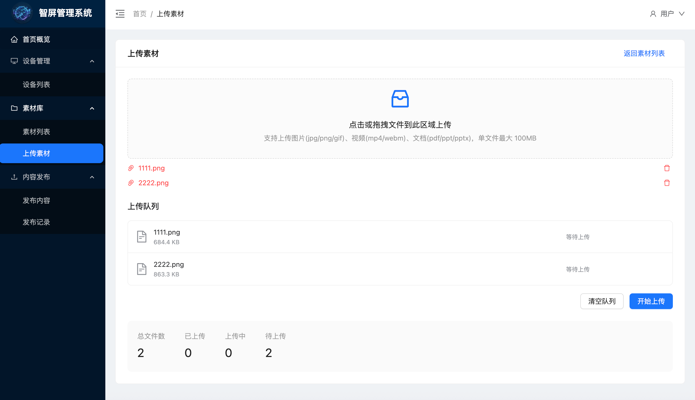
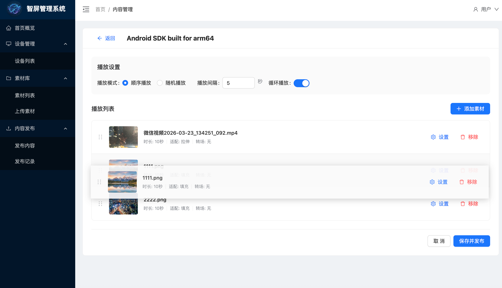
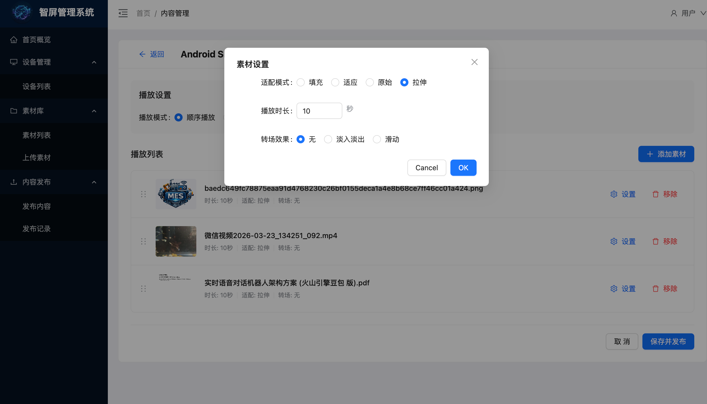

# Screen Cast Hub - 智屏管理系统

[English](./README.en.md) | **简体中文**

> 面向企业展厅、门店展示等场景的多屏内容管理系统

## 产品简介

**"一屏一码，扫码即管"** 的轻量化设备管理方案。

### 核心特性

- 📱 **扫码绑定** - TV端显示二维码，后台扫码即可绑定设备
- 📤 **远程发布** - 支持图片、视频、PPT、PDF等多种素材远程发布
- 🔄 **自动转码** - PPT自动转换为PDF，TV端直接播放 (开发中)
- 💾 **本地播放** - 内容下发后本地存储，无需手机在线
- 📊 **多屏管理** - 统一管理多个设备，分组展示

### 与传统投屏的区别

| 对比项 | 本方案 | 传统投屏(AirPlay/DLNA) |
|--------|--------|----------------------|
| 手机依赖 | 内容下发后可离线 | 需保持在线 |
| 多设备管理 | 集中式管理 | 点对点，难管理 |
| 文档支持 | PPT自动转PDF播放 | 不支持或体验差 |
| 网络要求 | 仅下发时需要 | 持续需要 |

---

## 系统截图

### 设备管理


### 素材管理


### 内容发布


### 排序功能


### 系统设置


### TV


---

## 项目结构

```
screen-cast-hub/
├── backend/           # 后端服务 (Spring Boot 单体应用)
├── android-tv/        # Android TV 客户端 (Java)
├── web-admin/         # PC 管理后台 (Vue 3 + Ant Design Vue)
└── README.md
```

---

## 技术栈

### 后端服务 (backend/)

| 技术 | 版本 | 说明 |
|------|------|------|
| Spring Boot | 3.2 | 基础框架 |
| Spring Security | - | 认证授权 |
| JWT | - | Token 认证 |
| MyBatis Plus | - | ORM 框架 |
| MySQL | 8.0 | 主数据库 |
| Redis | 7.0 | 缓存 |
| MinIO | - | 文件存储 |
| EMQX | - | MQTT 消息 |
| Gotenberg | - | PPT 转 PDF |

**包结构：**
```
com.opencast.screencast/
├── config/           # 配置类
├── constant/         # 常量
├── controller/       # 控制器
├── dto/              # DTO 对象
├── entity/           # 实体类
├── enums/            # 枚举
├── exception/        # 异常处理
├── mapper/           # Mapper 接口
├── result/           # 结果封装
├── service/          # 业务服务
└── util/             # 工具类
```

### PC 管理后台 (web-admin/)

| 技术 | 版本 | 说明 |
|------|------|------|
| Vue | 3.4 | 前端框架 |
| Ant Design Vue | 4.2 | UI 组件库 |
| Pinia | 2.1 | 状态管理 |
| Vue Router | 4.2 | 路由 |
| Vite | 5.0 | 构建工具 |
| TypeScript | 5.6 | 类型支持 |
| Axios | 1.6 | HTTP 客户端 |

**功能模块：**
- 登录认证
- 设备管理（绑定、重命名、解绑）
- 素材管理（上传、预览、删除）
- 内容发布（创建任务、查看记录）
- 仪表盘（统计概览）

**开发端口：** `5173`

### Android TV 客户端 (android-tv/)

| 技术 | 版本 | 说明 |
|------|------|------|
| Java | 8+ | 开发语言 |
| ExoPlayer | - | 视频播放 |
| AndroidPdfViewer | - | PDF 播放 |
| Glide | - | 图片加载 |
| Retrofit | - | 网络请求 |
| Room | - | 本地存储 |

**功能模块：**
- 设备绑定（显示二维码）
- 内容接收（MQTT）
- 本地播放（图片轮播、视频、PDF）
- 心跳上报

---

## 快速开始

### 1. 后端启动

```bash
cd backend

# 配置数据库
# 修改 src/main/resources/application.yml

# 启动
mvn spring-boot:run
```

### 2. PC 管理后台启动

```bash
cd web-admin
npm install
npm run dev
```

访问：http://localhost:5173


访问：http://localhost:5174

### 3. Android TV 构建

```bash
cd android-tv
./gradlew assembleDebug
```

---

## 开发计划

### 待开发功能

| 功能 | 状态 | 说明 |
|------|------|------|
| PPT 转 PDF | 📋 计划中 | 集成 Gotenberg 服务，实现 PPT 自动转 PDF |

---

## 联系我

📧 Email: liang.qfzc@gmail.com

微信：


---

## License

MIT


